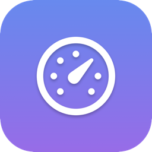
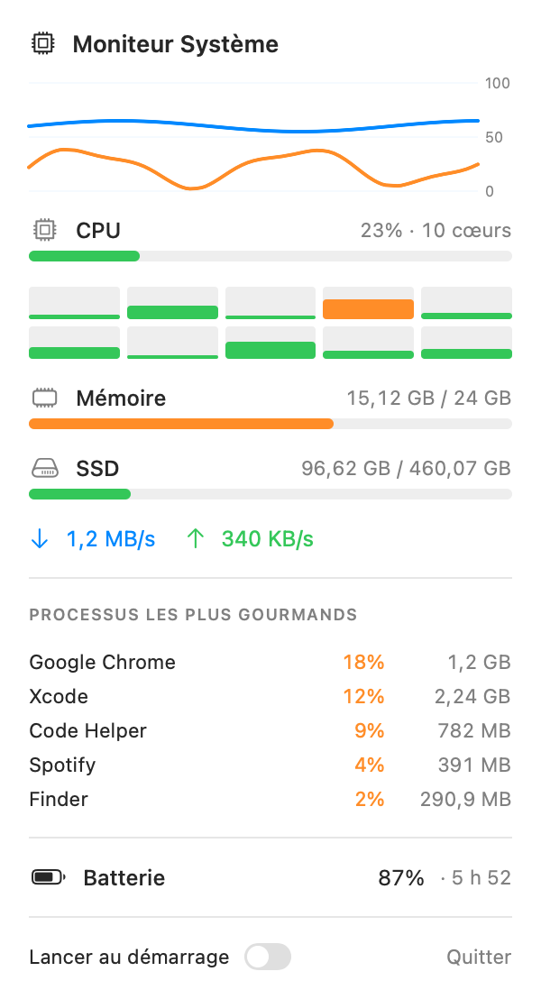

<p align="center">
  
</p>

<h1 align="center">Moniteur Système (macOS)</h1>

<p align="center">
  Outil de monitoring système natif pour Mac, écrit en <b>Swift</b> (AppKit + SwiftUI).<br>
  Affiche en temps réel dans la barre de menu : <b>CPU, mémoire, SSD, réseau et batterie</b>.
</p>

## Aperçu

Dans la barre de menu : `🖥️ CPU 23%  RAM 68%`
Au clic, un menu déroulant détaille toutes les métriques avec des jauges colorées,
un mini-graphique d'historique et le top des processus.

<p align="center">
  
  <br>
  <em>Le menu déroulant : historique CPU (orange) / RAM (bleu), jauge CPU et détail par cœur,
  mémoire, SSD, débit réseau, top des processus, batterie et interrupteur de démarrage.</em>
</p>

## Fonctionnalités

- 📊 **Historique** CPU + RAM (mini-graphique 60 s, Swift Charts)
- 🧮 **Détail par cœur** CPU
- 📈 **CPU, mémoire, SSD, réseau ↑/↓, batterie** en temps réel
- 🔥 **Top 5 des processus** les plus gourmands (CPU/RAM)
- 🚀 **Lancer au démarrage** (interrupteur intégré, `SMAppService`)
- 🪶 **Léger** : ~45 Mo de RAM, ~1 % CPU — cadence adaptative (3 s fermé / 1,5 s ouvert)

## Métriques collectées (API natives)

| Métrique   | Source native                                         |
|------------|-------------------------------------------------------|
| CPU        | `host_processor_info` (ticks par cœur, global + cœurs)|
| Mémoire    | `host_statistics64` (VM) + `sysctl hw.memsize`        |
| SSD        | `URLResourceValues` (capacité APFS réelle)            |
| Réseau     | `getifaddrs` (compteurs d'octets → débit ↑/↓)         |
| Batterie   | IOKit `IOPSCopyPowerSourcesInfo`                      |
| Processus  | `libproc` (`proc_listpids` + `proc_pid_rusage`)       |

## Prérequis

- macOS 13+
- Xcode Command Line Tools (`xcode-select --install`)

## Compilation & lancement

```bash
# 1) Construire l'app double-cliquable (.app)
./build_app.sh
open "Moniteur Système.app"

# — ou — lancer directement en développement
swift run -c release
```

## Lancer automatiquement au démarrage

Réglages Système → Général → Ouverture → **+** → choisir `Moniteur Système.app`.

## Structure

```
Sources/MacSystemMonitor/
├── main.swift          # Point d'entrée + AppDelegate (icône barre de menu, popover)
├── Metrics.swift       # Collecte bas-niveau (Mach / IOKit / FS)
├── Processes.swift     # Top des processus via libproc (%CPU instantané, RAM)
├── SystemMonitor.swift # Modèle observable + rafraîchissement adaptatif + historique
├── LoginItem.swift     # Lancement au démarrage (SMAppService)
└── ContentView.swift   # Interface SwiftUI du menu déroulant

make_icon.swift         # Génère l'icône (AppIcon.icns) via AppKit/CoreGraphics
build_app.sh            # Compile + empaquette l'app (.app) avec l'icône
```

## Icône

L'icône est générée par code (pas d'éditeur d'image) : `swift make_icon.swift` rend
le symbole `gauge.with.dots.needle.67percent` en blanc sur un dégradé bleu→violet, puis
`sips` + `iconutil` produisent `AppIcon.icns`. Modifie le symbole ou les couleurs
directement dans `make_icon.swift` pour personnaliser.

## Personnalisation rapide

- **Fréquence de rafraîchissement** : `SystemMonitor(interval: 2.0)` dans `main.swift`.
- **Seuils de couleur des jauges** : fonction `levelColor` dans `ContentView.swift`.
- **Texte de la barre de menu** : `updateTitle(_:)` dans `main.swift`.
